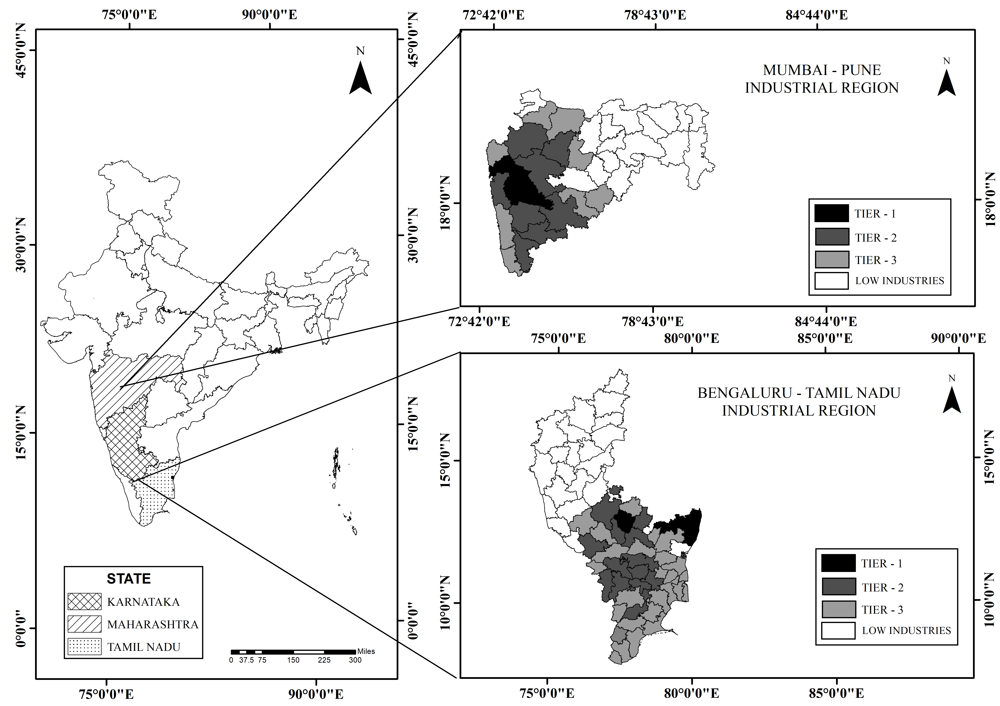

# Industrial Region GIS Analysis

## 📍 Study Areas
- Mumbai–Pune Industrial Region  
- Bangalore–Tamil Nadu Industrial Region  

## 📖 Project Overview
This project presents a GIS-based comparative analysis of two major industrial regions in India. It focuses on spatial distribution, infrastructure, industrial growth patterns, and regional development.

## 🛠️ Tools & Techniques
- ArcGIS / QGIS  
- Remote Sensing  
- Spatial Analysis  

## 🗺️ Study Area Map

## 🎯 Objective
To analyze and compare the spatial and economic characteristics of major industrial corridors in India.

## 👨‍🎓 Author
Aadil Mubarak
